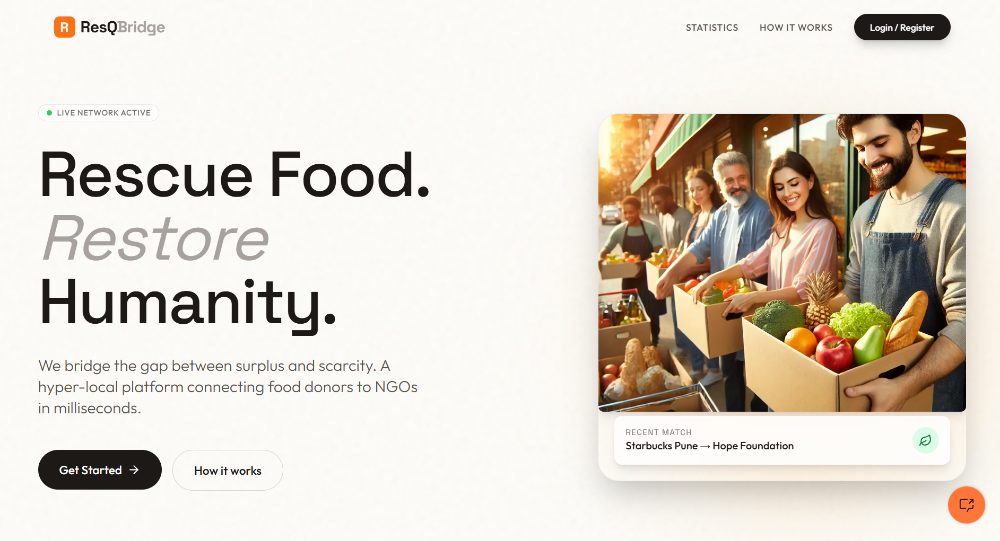
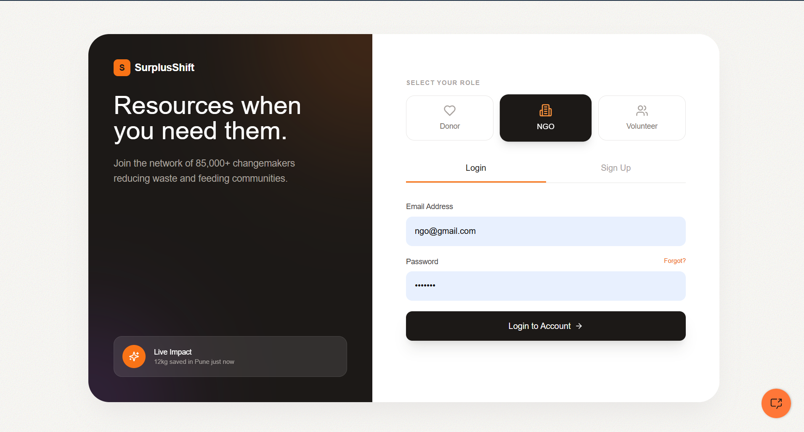
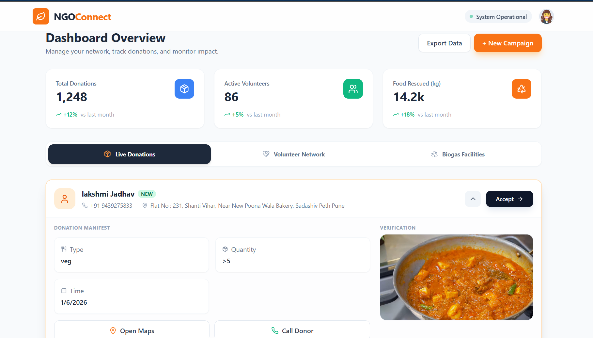
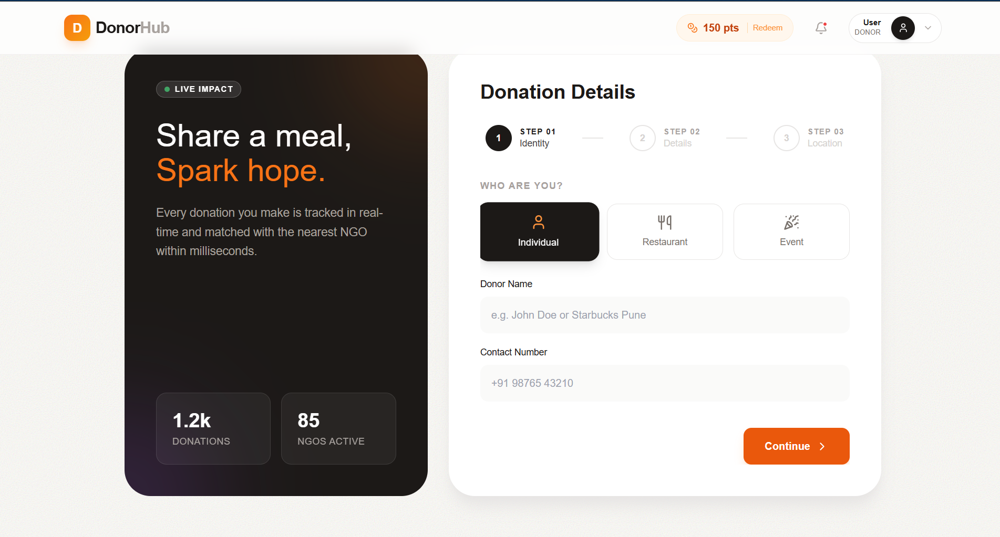

# 🌍 ResQ-Bridge
### Rescue Food. Restore Humanity.

[](https://res-q-bridge.vercel.app)







---

## 📖 Table of Contents
1. [What is ResQ-Bridge?](#-what-is-resq-bridge)
2. [How It Works (System Architecture)](#-how-it-works-system-architecture)
3. [Key Features](#-key-features)
4. [Tech Stack](#-tech-stack)
5. [AI Integration (TensorFlow)](#-ai-integration-tensorflow)
6. [Project Structure](#-project-structure)
7. [Installation](#-installation)

---

## 💡 What is ResQ-Bridge?

**ResQ-Bridge** is a smart food waste reduction platform designed to bridge the gap between surplus food and scarcity. It streamlines the donation process by connecting restaurants and individuals with local NGOs.

To ensure safety and efficiency, the platform uses a **Hybrid Microservice Architecture**. A **Python Flask AI service** validates food quality via image recognition (TensorFlow) before listing it, while a **Spring Boot backend** manages secure logistics and geolocation.

---

## ⚙️ How It Works (System Architecture)

We utilize a **Microservices approach** to separate core logic from heavy AI processing.

### 1. AI-Powered Verification (Flask + TensorFlow)
Before a donation is accepted, it must be verified.
* **The Flow:** The donor uploads an image of the food.
* **The AI:** The Spring Boot backend forwards this image to our **Flask Microservice**.
* **The Model:** A **TensorFlow/Keras model** analyzes the image to classify it:
    * **Class A:** Edible Food (Approved for NGOs).
    * **Class B:** Non-Food (Rejected).
    * **Class C:** Spoiled/Rotten (Redirected to Biogas Plant).

### 2. Geo-Location & Routing (Google Maps)
* **Donor:** Enters address, which is geocoded into Latitude/Longitude.
* **NGO Dashboard:** When an NGO accepts a donation, the system generates a **direct navigation link** to the donor's location using the Google Maps API, optimizing pickup times.

### 3. Biogas Integration
* If the AI or Volunteer marks food as "Spoiled", the system automatically reroutes the donation logic to notify nearby **Biogas Plants** instead of NGOs, ensuring zero waste.

---

## 🛠 Key Features

- **🔐 Secure Authentication:** Role-Based Access Control (Donor/NGO) using **Spring Security & JWT**.
- **🤖 AI Food Validation:** Automated image classification (Food vs. Non-Food) to prevent spam and ensure quality.
- **📍 Smart Navigation:** One-click Google Maps redirection for NGOs to find donors.
- **📊 Volunteer Management:** NGOs can assign pickup tasks to registered volunteers.
- **♻️ Waste-to-Energy:** Automated workflow to redirect spoiled food to biogas facilities.
- **📱 Responsive Dashboard:** Built with Next.js and Tailwind CSS for mobile-friendly access.

---

## 💻 Tech Stack

### Backend Ecosystem
- **Core Service:** Java Spring Boot 3 (REST API, Security, Business Logic)
- **AI Service:** Python Flask (TensorFlow Model Hosting)
- **Database:** MongoDB (NoSQL for flexible schema storage of donations & users)
- **Authentication:** JWT (JSON Web Tokens)

### Frontend
- **Framework:** Next.js 14 (React)
- **Styling:** Tailwind CSS
- **Deployment:** Vercel

---

## 🧠 AI Integration (TensorFlow)

The AI model was trained on a dataset of 10,000+ food images to distinguish between fresh meals and waste.

```python
# Flask Endpoint Snippet (AI Service)
@app.route('/predict', methods=['POST'])
def predict_food():
    image = request.files['image']
    # Preprocess image for TensorFlow
    processed_image = prepare_image(image)
    # Run Inference
    prediction = model.predict(processed_image)
    
    if prediction == "SPOILED":
        return jsonify({"status": "BIOGAS_REDIRECT"})
    else:
        return jsonify({"status": "APPROVED", "type": prediction})